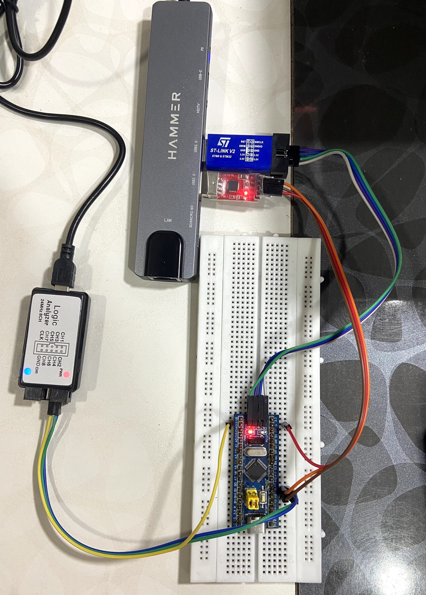

# STM32 Bare-Metal UART Driver

A bare-metal UART driver project built for the **STM32F103C8T6 (ARM Cortex-M3)** using register-level programming.

The project demonstrates the progression from polling-based UART communication to interrupt-driven and DMA-based reception without using STM32 HAL or LL.

---

# Features

- Polling-based UART transmission
- Non-blocking polling-based UART reception
- Interrupt-driven UART reception
- Interrupt-driven reception with a single-producer, single-consumer ring buffer
- Circular DMA-based UART reception
- Logic-analyser-based timing and latency measurements
- Serial-terminal example application

UART transmission remains polling-based in all implementations.

---

# Hardware

- STM32F103C8T6 (Blue Pill)
- CP2102 USB-to-UART adapter
- ST-Link V2
- Logic analyser

---

# Project Goals

This project explores different UART reception methods on the STM32F103 and compares their effects on CPU involvement and application behavior.

Topics covered include:

- Register-level GPIO and USART configuration
- Polling-based UART communication
- Interrupt-driven UART reception
- Moving application processing outside the ISR using a ring buffer
- Continuous UART reception using circular DMA
- Timing and latency measurement using a logic analyser

---

# Implementations

| Directory | RX method | Description |
| --- | --- | --- |
| [`polling/`](polling/) | Non-blocking polling | The main loop checks for available data and must service the UART frequently |
| [`interrupt/`](interrupt/) | RX interrupt | Passes each received byte to an application callback from the USART ISR |
| [`interrupt-ringbuffer/`](interrupt-ringbuffer/) | Interrupt + ring buffer | The ISR buffers received bytes while the main loop processes them |
| [`dma-circular-buffer/`](dma-circular-buffer/) | Circular DMA | DMA buffers received bytes without a per-byte USART interrupt |

The example application echoes received characters and prints the completed line when Return is pressed.

---

# Cooperative Superloop

The polling, interrupt-with-ring-buffer, and circular DMA implementations run UART processing alongside a background calculation task using a cooperative superloop:

```c
while (1) {
  process_usart1_received_data();
  sum_n = run_background_calculation(...);
}
```

The non-blocking polling implementation requires the calculation task to remain short so that the UART is serviced frequently. The ring-buffer and circular DMA implementations continue receiving and buffering UART data while the calculation task runs, allowing the main loop to process the data afterward.

The direct-interrupt implementation processes received byte inside the USART interrupt handler.

---

# Hardware Connections

| STM32F103C8T6 | USB-UART adapter |
| --- | --- |
| PA9 (USART1 TX) | RXD |
| PA10 (USART1 RX) | TXD |
| GND | GND |

TX and RX are cross-connected. The USB-UART adapter must use **3.3 V logic levels**.

---

# Hardware Setup



The setup includes the STM32F103C8T6, CP2102 USB-to-UART adapter, ST-Link V2, and logic analyser used for communication, programming, debugging, and timing measurements.


---

# UART Configuration

- USART1
- 115200 baud
- 8 data bits
- No parity
- 1 stop bit
- No flow control
- 8 MHz peripheral clock

---

# Ring-Buffer Design

The interrupt-ring-buffer implementation uses a single-producer, single-consumer design:

```text
USART1 Interrupt                    Main Loop
        │                               │
ringbuffer_put(byte)              ringbuffer_get(&byte)
        │                               │
        ▼                               ▼
      head ───────► RX Buffer ───────► tail
```

- The USART ISR is the only producer.
- The main loop is the only consumer.
- Only the ISR modifies `head`.
- Only the main loop modifies `tail`.

The ring buffer contains 64 slots, of which 63 are usable. One slot is reserved to distinguish the full and empty states.

Because the buffer size is a power of two, index wrapping uses a bit mask:

```c
head = (head + 1) & (RINGBUFFER_SIZE - 1);
```

---

# Circular DMA Reception

DMA1 Channel 5 transfers received USART1 bytes directly into a 32-byte circular buffer.

The application determines the current DMA write position from the channel’s remaining-transfer count, `DMA1_CNDTR5`.

Circular DMA reception avoids executing a USART interrupt for every received byte.

---

# Directory Structure

```text
stm32-bare-metal-uart-driver/
├── polling/
├── interrupt/
├── interrupt-ringbuffer/
├── dma-circular-buffer/
├── debugging/
│   └── logic-analyser/
├── .gitignore
└── README.md
```

Each implementation contains its own source files, register definitions, startup code, linker script, and Makefile.

---

# Logic-Analyser Validation

The [`debugging/logic-analyser/`](debugging/logic-analyser/) directory contains captures used to measure:

- UART echo latency across polling, interrupt-driven, and ring-buffered interrupt reception
- USART interrupt-handler execution time
- Latency introduced by blocking application code
- UART string-transmission time
- Background calculation task execution time

The directory includes screenshots and raw PulseView and Saleae session files.

---

# Learning Outcomes

This project provided practical experience with:

- Configuring STM32 USART, GPIO, NVIC, and DMA through memory-mapped registers
- Implementing polling, interrupt-driven, and DMA-based UART reception
- Moving received-byte processing out of the ISR using a ring buffer
- Consuming received data from a circular DMA buffer
- Comparing the timing constraints of polling, interrupt-driven, ring-buffered, and DMA-based UART reception
- Measuring UART echo latency, interrupt-handler execution time, and background-task execution time with a logic analyser

---

# Build

Select an implementation:

```bash
cd interrupt-ringbuffer
```

Build the firmware:

```bash
make
```

Flash the firmware:

```bash
make flash
```

---

# Serial Terminal

Find the USB-UART device on macOS:

```bash
ls /dev/cu.*
```

Connect using `screen`:

```bash
screen /dev/cu.usbserial-XXXX 115200
```

---

# Development Tools

- Arm GNU Toolchain
- GDB
- GNU Make
- st-flash
- ST-Link V2
- PulseView / Saleae Logic

---

# Current Limitations

- UART transmission is polling-based.
- UART hardware errors are not explicitly handled or reported.
- Received bytes are dropped silently when the ring buffer is full.
- Circular DMA buffer overrun is not detected.
- USART1 configuration is fixed to 115200 baud with an 8 MHz peripheral clock.